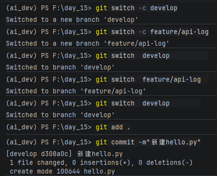
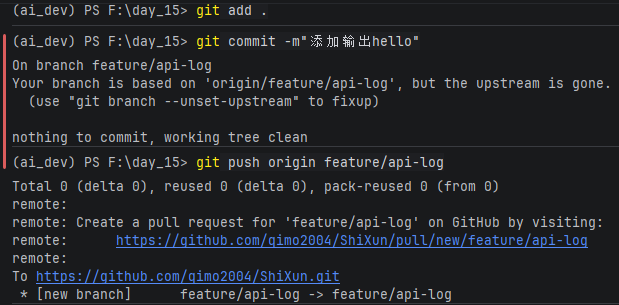
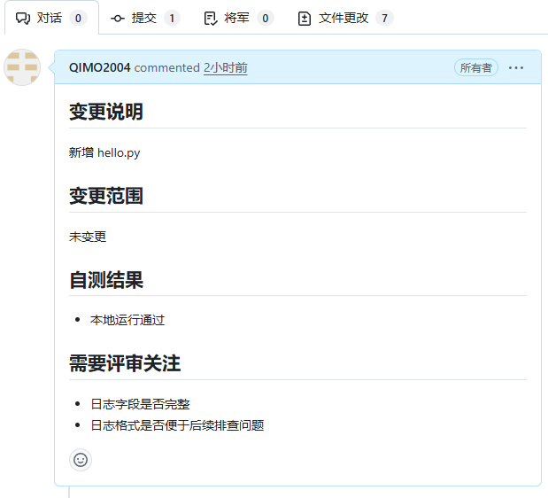
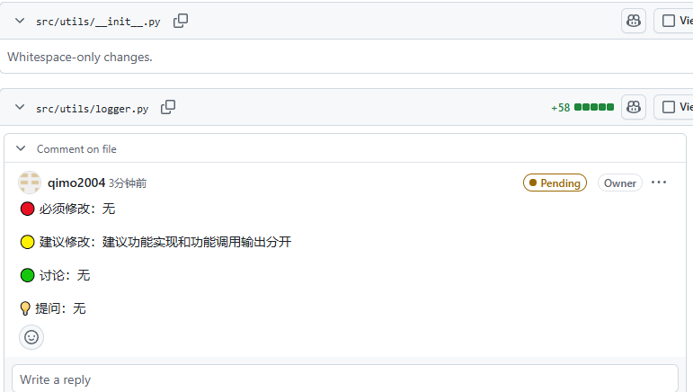
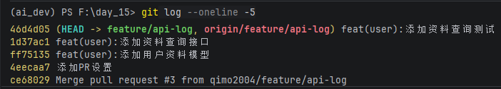

### 小练习-1

**练习目标：** 独立完成一次从分支创建到推送远程的完整流程。

**练习要求：**

1. 从 develop 拉取最新代码，创建 `feature/hello-world` 分支

2. 新建一个 `hello.py`，内容为 `print("Hello, PR!")`
3. 使用规范 commit 信息提交

4. 推送到远程并尝试创建 PR

### 小练习-2

**练习目标：** 对同学的 PR 给出结构化评审意见。

**练习要求：**

1. 找到同学在上一部分练习中创建的 PR
2. 阅读代码变更，至少给出 2 条评审意见
3. 意见必须使用分类标签（必须修改/建议修改/讨论/提问）

### 小练习-3

**练习目标：** 按团队规范重新整理已有提交。

**练习要求：**

1. 查看自己最近 5 条 commit 信息
2. 判断哪些不符合 Conventional Commits 规范
3. 写出修正后的 commit 信息

### 小练习-4

**练习目标：** 处理已跟踪文件的忽略问题。

**练习要求：**

1. 用 `git ls-files` 检查自己项目中是否有不该跟踪的文件（如 `__pycache__`、`.env`、`*.log`）
2. 如果有，用 `git rm --cached` 移除跟踪并提交
3. 配置全局 gitignore（`~/.gitignore_global`），至少包含 `.DS_Store` 和 IDE 配置
4. 运行 `git status` 确认忽略生效
